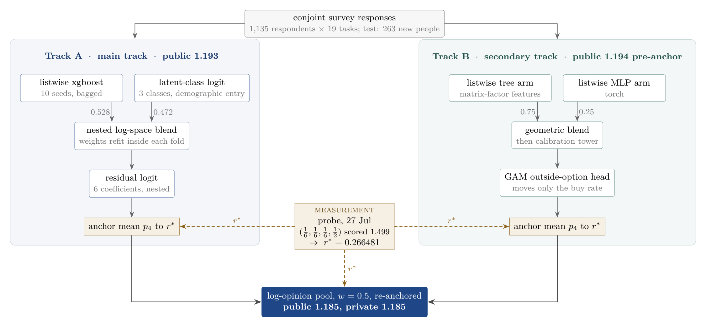
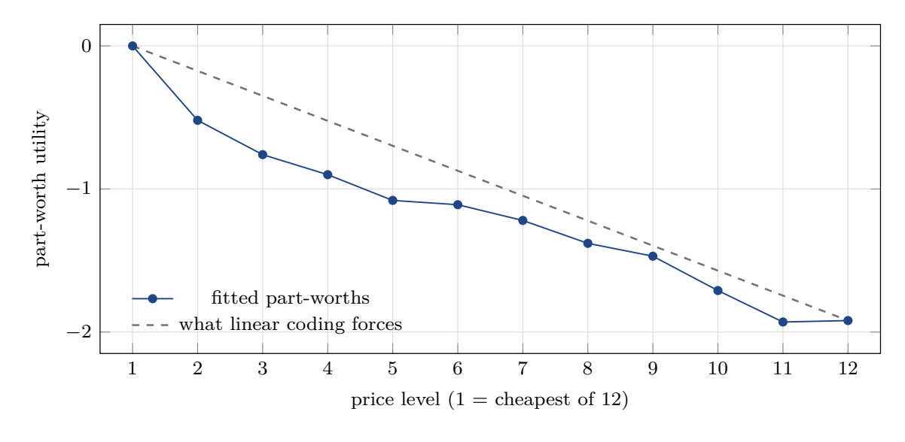
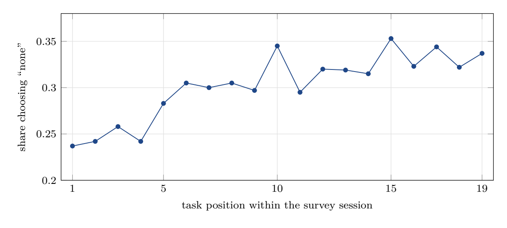

# Predicting Choice Among Car Safety Bundles


[](https://www.kaggle.com/competitions/the-analytics-edge-competition-2026)


A Kaggle-style discrete-choice competition: given a conjoint survey in which 1,135
respondents each faced 19 choice tasks, predict which of three car safety bundles a
**brand-new** respondent picks, or whether they walk away, scored by multiclass log loss
on 263 unseen people.

Our submission scored **1.185 on the public board and 1.185 on the private board**,
identical to three decimal places, against a 1.386 benchmark. Every forecast we committed
to version control before uploading came true, including the final score to within one
tick. This repository holds the full pipeline, 80+ logged experiments including the
failures, and the final report.

<!-- KAGGLE:START -->
> **Read from the [Kaggle leaderboard](https://www.kaggle.com/competitions/the-analytics-edge-competition-2026) on 05 August 2026:** team `Sheil_Mistry_Team_3` placed **3 of 66** on the public board with a score of **1.185**. Kaggle serves the public leaderboard through its API, so the private placing of 4th is not shown here. This line is written by [a workflow](.github/workflows/kaggle-result.yml), not by hand.
<!-- KAGGLE:END -->

**Team 3 R-izzlers:** Chia Zhi Feng, Kavya Santosh Nair, Sheil Ketan Mistry, Nicole Ann Chia.



The graded file is an equally weighted log-opinion pool of two tracks built
independently by different team members with no shared code. Both tracks are anchored to
a single constant, `r*`, that we did not fit at all: we measured it from the leaderboard
itself (the amber thread above).

## The measurement that beat two weeks of model search

One daily submission was spent on a constant prediction, `(1/6, 1/6, 1/6, 1/2)` on every
row. For a constant prediction the log loss is algebra in one unknown, so the returned
score inverts into the test set's true walk-away rate:

```
score = log 6  -  r · log 3          the board returned 1.499
r*    = (log 6 - 1.499) / log 3  =  0.2665
```

That single measured constant ended up worth more than roughly 160 searched model
variants on the final day, because it is a fact about the test set rather than a guess
fitted on training folds. It also transferred: calibrated purely against public rows, it
then met 1,499 private rows it had never touched, and the displayed score did not move.

| pre-registered forecast (committed before upload) | predicted | returned |
|---|---|---|
| track A final file | 1.1930 | 1.193 |
| graded pool | 1.186, band 1.184 to 1.189 | **1.185** |

## What the data taught us

**Price response flattens.** Giving each of the 12 price levels its own utility instead
of a straight line was the single largest gain (+0.020 log loss). The first price step
costs buyers 0.52 utility; later steps average 0.13; the top two levels are
indistinguishable.



**A third of respondents are not reachable by discounts.** A three-class latent-class
logit, with class membership predicted from demographics only, splits the population into
value-conscious buyers (36.6%), price-indifferent buyers (32.1%), and a segment inclined
to decline at every tested price (31.4%).

**Survey fatigue behaves like sharpened price sensitivity.** The walk-away rate climbs
about ten percentage points across a session. A model that only lets price sensitivity
steepen with task position reproduces 105% of that drift; a "people answer more noisily"
account reproduces essentially none of it.



**Personal taste is only usable when a stranger's data can reach it.** Hierarchical
Bayes scores 0.352 when allowed to use each person's own fitted tastes and 1.229 when a
new respondent gets the population average; since every test respondent is a stranger,
the fanciest textbook model finished dead last. The latent-class model wins with the same
idea routed through a 58-parameter demographic bottleneck instead of 438 free parameters.

## Nine model families entered, two survived

| model family | OOF log loss | verdict |
|---|---|---|
| listwise xgboost, 10-seed bag | 1.137 | **blend member 1** |
| latent-class logit, 3 classes | 1.139 | **blend member 2** |
| nested logit | 1.157 | indistinguishable from plain logit |
| part-worth conditional logit | 1.157 | special case of member 2 |
| elastic-net logit | 1.167 | shrinkage cannot mimic part-worths |
| two-stage buy/which | 1.172 | splits one decision in two |
| mixed logit | 1.173 | predicts a population average |
| wide four-class xgboost | 1.175 | cannot compare within a choice set |
| hierarchical Bayes | 1.237 | cold start |

What separates the winners is not capacity but fit to the structure of the decision: a
shared utility scale across the four alternatives, ordinal attribute tiers left free to
bend, and heterogeneity routed through something observable about a new person.

## The part we are proudest of: the failures

The experiment log ([EXPERIMENTS.md](EXPERIMENTS.md)) records every dead end with the
number that killed it. Three earned a place in the final report:

- **A leak that honoured the fold rule.** A derived feature scored 1.0996, an apparent
  0.03 leap, while respecting leave-one-fold-out discipline perfectly. The leak was in
  the baseline it subtracted. Rebuilt so the leak was structurally impossible, the gain
  was **negative** (z = -4.5), even though every detector we had passed it.
- **A structural leak that survived 47 iterations.** An encoding applied once, before
  the CV loop, inflated scores uniformly in every fold, which is exactly why per-fold
  checks never caught it. Real effects saturate with model capacity; this one grew
  monotonically. That test, an honest twin, and an ablation are what finally killed it.
- **The seed is a hyperparameter nobody tunes.** Re-running one xgboost under ten seeds
  moved its score by more than most margins in our log. One accepted result died when
  retested paired across seeds.

The habit that survived the project: measure the noise floor before trusting a gain, and
build the honest twin of every clever construction.

## Validation discipline

- **Folds grouped by respondent, always.** Each person answers 19 tasks; a row-wise
  split lets a model learn the person instead of the product. Test respondents are
  strangers, so validation must make every scored respondent a stranger too.
- **Nested everything.** Blend weights, calibration coefficients, and feature scalings
  are refit inside each fold; no number we acted on had seen its own tuning data.
- **Three separate noise floors**, measured before quoting any margin: single-model seed
  sd 0.0028, blend-level seed sd 0.0005, fold-to-fold sd 0.013.
- **Paired tests with respondent-clustered standard errors** for every comparison.

## Repository map

```
model/                    track A pipeline: load, folds, members, blend, submit
experiments/              80+ numbered iterations, hypothesis and verdict in each header
  iter62_nnblend/         track B, the independent second track (tree + neural net)
  iter82_provenance/      assembly of the graded pool and its audit
submissions/              every scored CSV, plus log.md with the full submission history
report/                   final report, LaTeX source and PDF
EXPERIMENTS.md            the complete experiment log, failures included
STRATEGY_REVIEW.md        the mid-competition strategy audit
Vault/                    course-theory notes (Obsidian vault)
```

## Reproducing

R 4.6 with `data.table`, `xgboost` (3.x), `mlogit`, `dfidx`, `glmnet`, `Matrix`,
`bayesm`. Run everything from the repository root.

```bash
# track A, end to end (~2.5 h; each stage saves its artifacts and resumes if interrupted)
Rscript model/run_all.R

# reassemble the graded pool from the tracked prediction artifacts (~2 s)
Rscript experiments/iter82_provenance/build_candidates.R
```

On Windows, R is often not on PATH:

```powershell
& "C:\Program Files\R\R-4.6.0\bin\Rscript.exe" model/run_all.R
```

The graded submission itself is tracked at `submissions/cand_pool5050_final00.csv`.
Multithreaded tree training is not bit-reproducible across machines, so fresh retraining
lands within about 1e-3 of the scored artifacts; the pool assembly from tracked
artifacts is deterministic. The report documents both guarantees precisely.

## The report

The 8-page final report is the distilled version of everything here: the model, the
probe, the leak forensics, the behavioural findings, and why the public and private
scores agreed to the third decimal.

**[report/report.pdf](report/report.pdf)** ([LaTeX source](report/report.tex))

---

*Course project for SUTD 40.016 The Analytics Edge (2026), instructors Karthik Natarajan
and Yihan Du. Competition data belongs to the course; this repository stays private
until grading is complete.*
