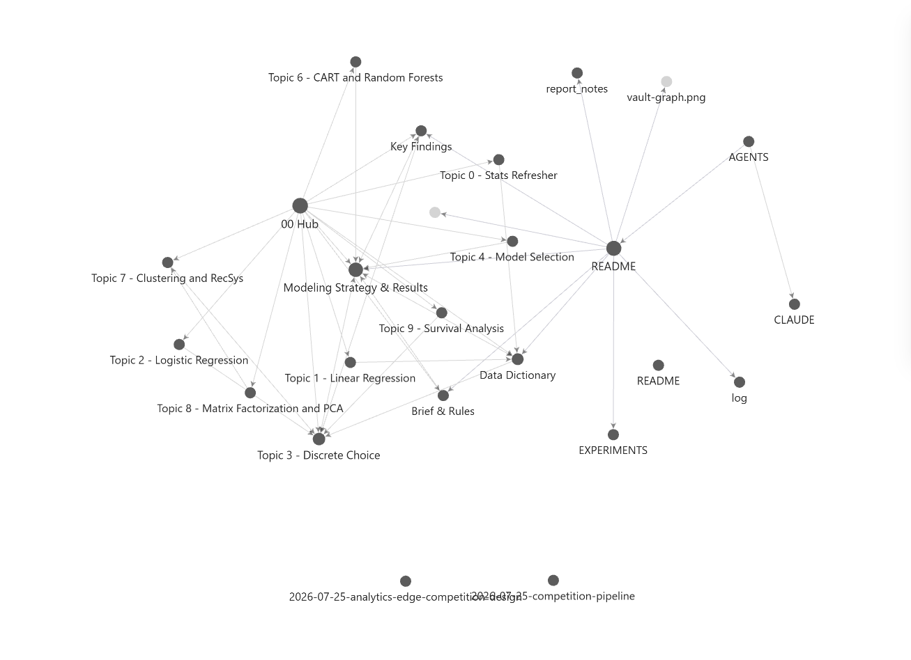

# TAE R-izzlers — Analytics Edge Data Competition 2026

Predicting which of four car safety-feature bundles a respondent chooses.
**R only** (competition rule). Metric: multiclass logloss, lower is better.

> ⚠️ **Keep this repository private until after 10 August 2026.** It contains the
> competition data and our full modelling approach. A public repo would hand both to
> every other team. Course rule also forbids sharing data outside the team.

---

## Where we stand

| | logloss |
|---|---|
| Benchmark (25% for everything) | 1.38629 |
| Our first submission | 1.2230 public |
| Rival team's known best | 1.210 public |
| **Ours now** | **1.201 public** (local CV 1.13556) |

Our local cross-validation and the Kaggle score differ by about +0.06. That gap is
expected — see [Why local ≠ Kaggle](#why-local--kaggle-matters) below, it's one of the
more interesting things we learned.

---

## Quick start

**Prerequisite:** R ≥ 4.5 with `data.table`, `xgboost`, `mlogit`, `dfidx`, `glmnet`, `Matrix`.

```r
install.packages(c("data.table","xgboost","mlogit","dfidx","glmnet","Matrix"))
```

**Run everything** (~30 min) from the repository root:

```powershell
# Windows: R is often not on PATH, so call it by full path
& "C:\Program Files\R\R-4.6.0\bin\Rscript.exe" model/run_all.R
```

```bash
# macOS / Linux
Rscript model/run_all.R
```

That writes a timestamped CSV into `submissions/`, ready to upload.

**Run only part of it** — every stage saves to `model/artifacts/`, so you can start midway:

```powershell
& "C:\Program Files\R\R-4.6.0\bin\Rscript.exe" model/run_all.R blend submit
```

Stages: `tests · data · folds · mnl_pw · xgb_lw · blend · submit · audit`

---

## Which model is the best one?

**The submission is a blend of exactly two models.** Everything else in the repo is
either supporting infrastructure or superseded work kept for the record.

| file | model | OOF | blend weight |
|---|---|---|---|
| [`model/03_xgb_listwise.R`](model/03_xgb_listwise.R) | xgboost with a **custom listwise softmax objective** | **1.14152** | 0.64 |
| [`model/02_mnl_partworth.R`](model/02_mnl_partworth.R) | conditional logit with **part-worth coded** levels | 1.15686 | 0.36 |
| [`model/06_blend.R`](model/06_blend.R) | combines them in log-space + temperature + uniform mix | **1.13556** | — |

If you only read two files, read those two models.

Everything in [`model/legacy/`](model/legacy/) scored worse and earns zero blend weight
(linear-coded logit, mixed logit v1 and v2, wide xgboost, elastic net). Kept because the
report discusses what we tried, not only what won.

---

## Repository map

```
model/                    the production pipeline
  run_all.R               ENTRY POINT — start here
  00_load.R               CSV -> long format (1 row per alternative) + features
  01_folds.R              5 CV folds, grouped by respondent (see below)
  02_mnl_partworth.R      MODEL 1 — part-worth conditional logit
  03_xgb_listwise.R       MODEL 2 — listwise-objective xgboost
  06_blend.R              weighted log-space blend, nested evaluation
  07_submit.R             writes the Kaggle CSV, validates format
  99_utils.R              logloss, fold construction, normalisation helpers
  encode_design.R         design-level empirical-share encoder
  compare.R               paired model comparison with clustered SEs
  shift_audit.R           does an improvement survive the train->test shift?
  members.txt             which models enter the blend
  tests.R                 unit tests
  legacy/                 superseded models (zero blend weight)

experiments/              research log — one folder per iteration, immutable
Vault/                    Obsidian knowledge base (course notes + competition)
submissions/              generated CSVs + log.md of every score we've seen
EXPERIMENTS.md            what we tried, what worked, and why — with reflections
report_notes.md           material for the 8-page report (worth 15 of 30 marks)
Raw Dump/                 course materials + competition data (unmodified)
```

---

## The three things that actually made the score

Each was verified with a paired test using respondent-clustered standard errors
(`model/compare.R`), not just a lower headline number.

### 1. Part-worth coding — the big one (+0.020, z = 11.8)

Attributes are 3–7 level tiers and Price has 12 levels, but we originally coded them as
plain numbers, which forces utility to move by a constant amount per level step. Giving
each level its own utility revealed that **price response is concave**:

| price level | 2 | 3 | 4 | 5 | … | 10 | 11 | 12 |
|---|---|---|---|---|---|---|---|---|
| utility | −0.52 | −0.76 | −0.90 | −1.08 | … | −1.71 | −1.93 | −1.92 |

Each step hurts less than the one before, and the top two levels are indistinguishable —
sensitivity saturates. People respond to price ratios, not differences.

### 2. Listwise objective (+0.006, z = 4.3)

The old xgboost scored each alternative as an independent "was this chosen?" binary and
we normalised afterwards. But the metric is a softmax over the four alternatives in a
choice set — only *relative* utility matters. A custom gradient (`p − y` with the softmax
taken within each 4-row task) makes the training loss identical to the competition metric.

### 3. Design-level encoding (+0.005, z = 2.9)

This is a *designed* conjoint experiment: only 299 distinct choice sets per task position,
each shown to ~4.7 people, and **98.5% of test rows reuse a design that appears in
training**. The empirical choice share within a design is therefore observable. Support is
thin (~3.8 rows per design) so the shares must be shrunk heavily — at weak shrinkage they
score *worse than the benchmark*.

---

## Why local ≠ Kaggle (matters)

**Folds are grouped by respondent.** Each person answers 19 choice tasks. If you split
randomly by row, a model sees 15 of someone's answers and is graded on the other 4 — it
learns "this person is stingy" and aces the holdout. Local score looks great; Kaggle
doesn't, because the test set is 263 people who appear nowhere in training. Splitting by
*person* makes local validation mirror the real task. This is the single most important
thing to preserve if you modify the pipeline.

**Nested blending.** Blend weights are refit five times, each excluding the fold it is
evaluated on, so no number we act on has seen its own tuning data.

**The test population is different.** Test respondents are roughly twice as wealthy
(median income $60k → $80k, p75 $85k → $125k). `model/shift_audit.R` reweights training
respondents to look like the test population and rechecks every improvement. Part-worth
coding retains 101% of its value and the listwise objective 112% — both structural. The
design encoding retains only 77%, since its shares encode a poorer population's tastes.

---

## Working agreements

- **One Kaggle account only** (team representative's). Using more than one is an academic
  integrity violation under the competition rules.
- **Two submissions per day**, resetting ~08:00 SGT.
- **Record every public score** in [`submissions/log.md`](submissions/log.md) — that's how
  we calibrate what a local improvement is actually worth.
- **R only.** Any package is allowed; other languages are not.

---

## The knowledge base

`Vault/` is an Obsidian vault covering the course theory and the competition work.
**Open the repository root as the vault** (not `Vault/` itself) so the lecture PDFs under
`Raw Dump/` open as links inside Obsidian. Note-to-note links use bare filenames, so they
resolve either way; the PDF links need the repo root.

<!-- To add the graph view: in Obsidian press Ctrl+G (graph view), arrange it, then use
     Win+Shift+S to snip. Save as docs/images/vault-graph.png and this will render. -->


Start at `Vault/00 Hub.md`. The competition notes are:
[Brief & Rules](Vault/Competition/Brief%20&%20Rules.md) ·
[Data Dictionary](Vault/Competition/Data%20Dictionary.md) ·
[Modeling Strategy & Results](Vault/Competition/Modeling%20Strategy%20&%20Results.md) ·
[Key Findings](Vault/Competition/Key%20Findings.md)

## Reading order for someone new

1. This README
2. [`EXPERIMENTS.md`](EXPERIMENTS.md) — every hypothesis, result, and what we'd do
   differently, including the failures
3. [`model/02_mnl_partworth.R`](model/02_mnl_partworth.R) and
   [`model/03_xgb_listwise.R`](model/03_xgb_listwise.R) — the two models
4. [`report_notes.md`](report_notes.md) — findings written up for the report
5. `Vault/` — open the repository root as an Obsidian vault; start at `Vault/00 Hub.md`
